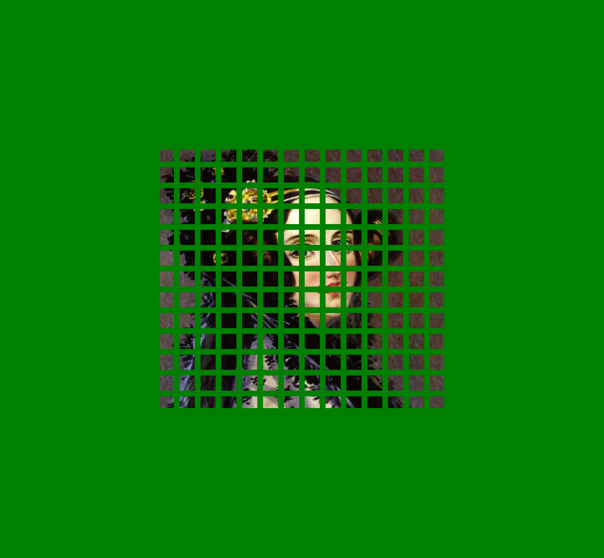
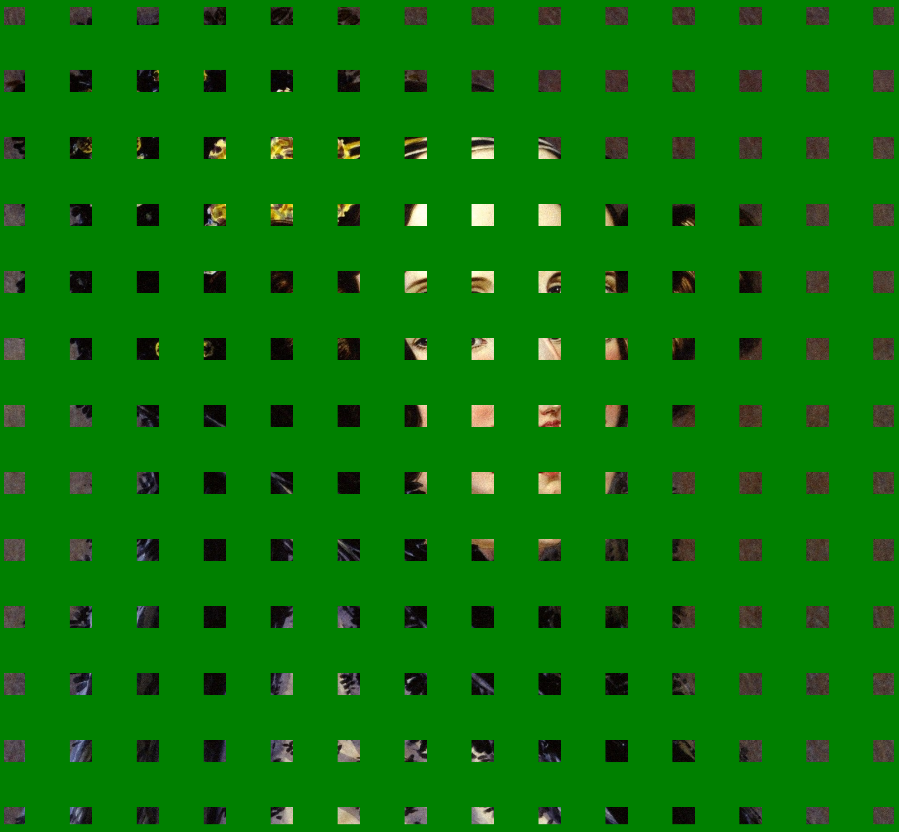
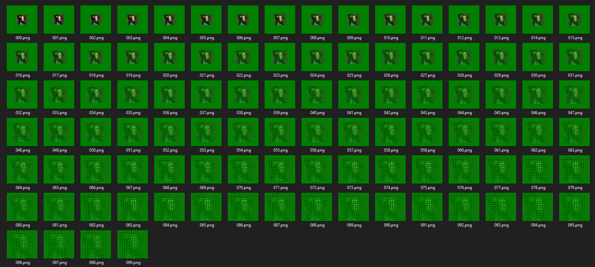

# ImageToGridAnimator

Sipmple program that create frames for animation where image being splited into grid and..... i just gona past images as example))

(One iteration = 1pixel)

Adjust settings in `{exeFolder}\ImageToGridAnimator\Settings.txt`

First image (your input image but it's size adjusted to fit final iteration):

Second image:

After couple of iterations:

Final:

Output folder:

